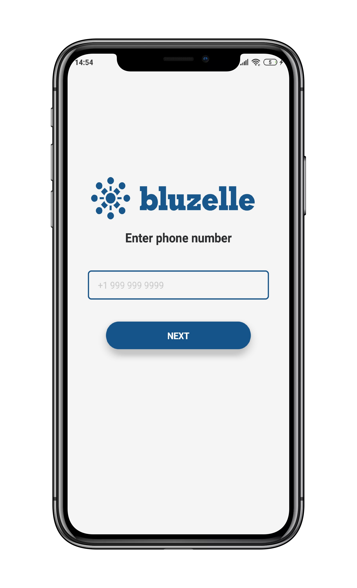
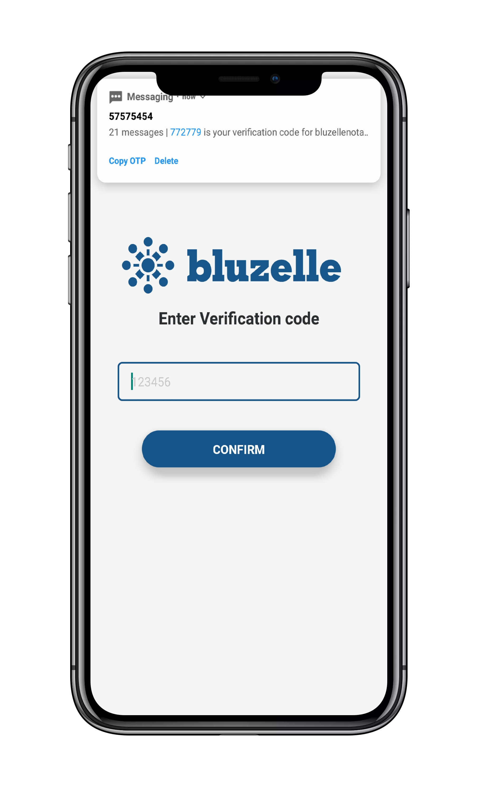
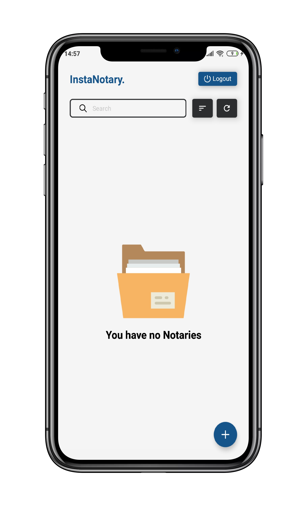
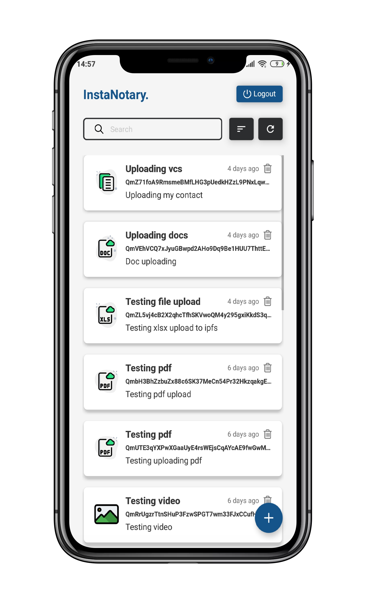
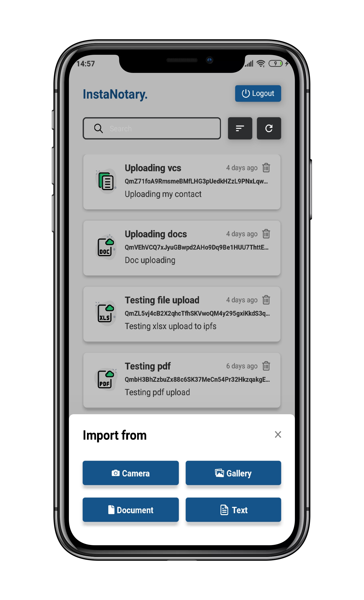
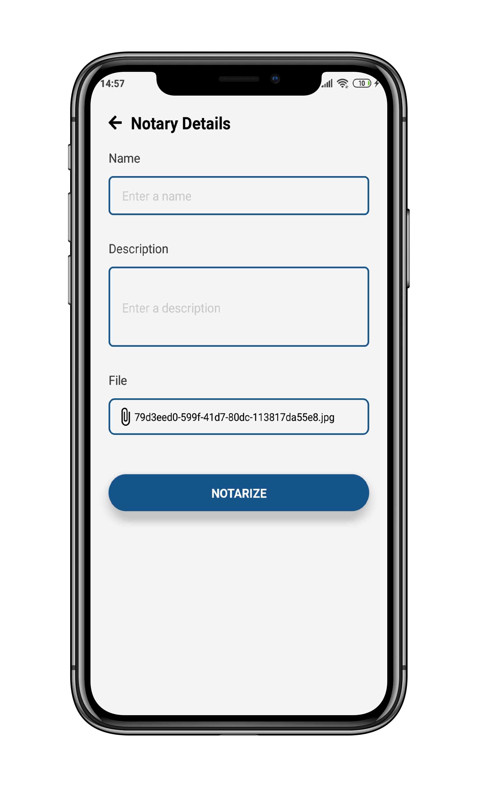
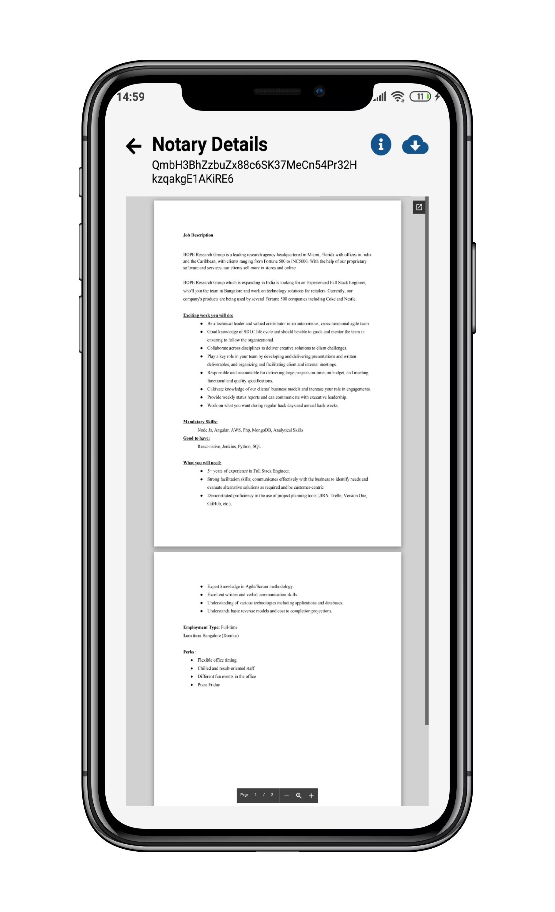
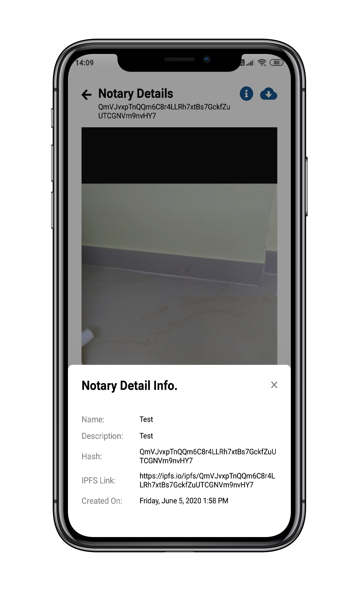

# Project Instanotary

This React Native based application aims to give users a way to instantly notarize any data or file they want with current datetime.<br>
Find apk [here](https://github.com/mmitrasish/InstaNotary/releases).

## Feature List

### App Side Features

1. Login using phone auth with just phone number and verification code.

### Notary

1. Add image directly from camera/gallery, documents like .doc, .pdf, etc, video and text too.
2. Notarize the file with name and description and timestamp.
3. The file is permanently stored in IPFS, User can use the hash from the app to directly lookup their file.
4. Showing preview for viewable file.
5. User can Download both viewable and non-viewable file.

### Codebase

1. This application is purely written in react native thus it can run on both iOS and android without changing a single line of code.
2. Clean codebase for easy modeification and usage.

#### NOTE 1:- This application is throughly tested to be running on android as well as iOS without any change in code, but if you face any issues please reach out to me on telegram `@rekpero` or discord `@rekpero#3898`

#### NOTE 2:- I tried to impliment all the possible checks, but if you encounter any issues or bugs, please reach out to me.

## Configuration

We have added a magic number for directly accessing the app without authentication, The number is `+1 9999999999`

There is additional configuration to disable this magic number authentication, This can be easily handled by updating config/index.js with

```
MAGIC_NUMBER_AUTH = false
```

## How to run?

This app is built with [expo](https://expo.io/learn) (a wrapper for react-native). To run this app, first you need to install expo-cli

```
yarn global add expo-cli
```

Now, clone the repo and do these:

```
git clone https://github.com/mmitrasish/InstaNotary.git
cd InstaNotary
yarn
```

To run the android app, you can directly download the app from [Release](https://github.com/mmitrasish/InstaNotary/releases/tag/Alpha-v1.0.0), I have app in both apk and bundled form.
Or, if you want to run from the repo, you have to first download the expo app in both [android play store](https://play.google.com/store/apps/details?id=host.exp.exponent&hl=en_IN) and [ios app store](https://apps.apple.com/us/app/expo-client/id982107779), then you can follow these steps:

```
cd InstaNotary
expo start //This will open a window in http://localhost:19002
```

Now you have to open expo app in android and ios and scan the QR code from the metro bundler in http://localhost:19002 ,You will be able run the app now.

## How to Build?

Be sure to update the versions (for each of Android and iOS) in app.json in the root, between build updates.

You can build the app using expo commands:

- For Android

```
expo build:android -t apk // for building apk
expo build:android -t app-bundle // for building bundle
```

These command directly build your app but you have to create an account on expo. Also for more details regarding building for android you can follow this doc [Expo Android Build Doc](https://docs.expo.io/distribution/building-standalone-apps/#if-you-choose-to-build-for-android). This has a step by step instructions to build your app.

- For IOS

```
expo build:ios -t archive // for app store
expo build:ios -t simulator // for simulation
```

Same as of android. Also for more details regarding building for ios you can follow this doc [Expo IOS Build Doc](https://docs.expo.io/distribution/building-standalone-apps/#if-you-choose-to-build-for-ios). This has a step by step instructions to build your app.

_Or you can directly build ios and android app from xcode and android studio directly which is same as you do for standalone app._

## Demo Video

You can watch the small demo video [here](https://drive.google.com/file/d/1Mm8V093ULBbVRPmZH0JZQ6uhasFEbQXB/view?usp=sharing).

## License

Instanotary is licensed under [the MIT license](https://github.com/mmitrasish/InstaNotary/blob/master/LICENSE).

## Screenshots

 
 
 
 

- Head over to screenshots folder for more screenshots.
